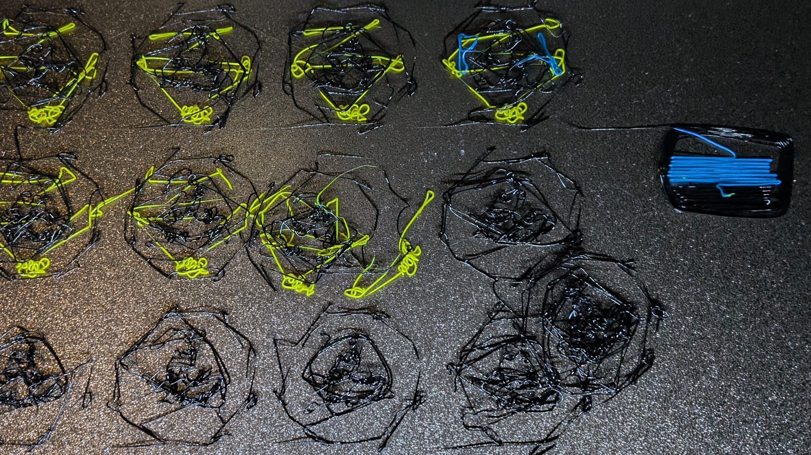
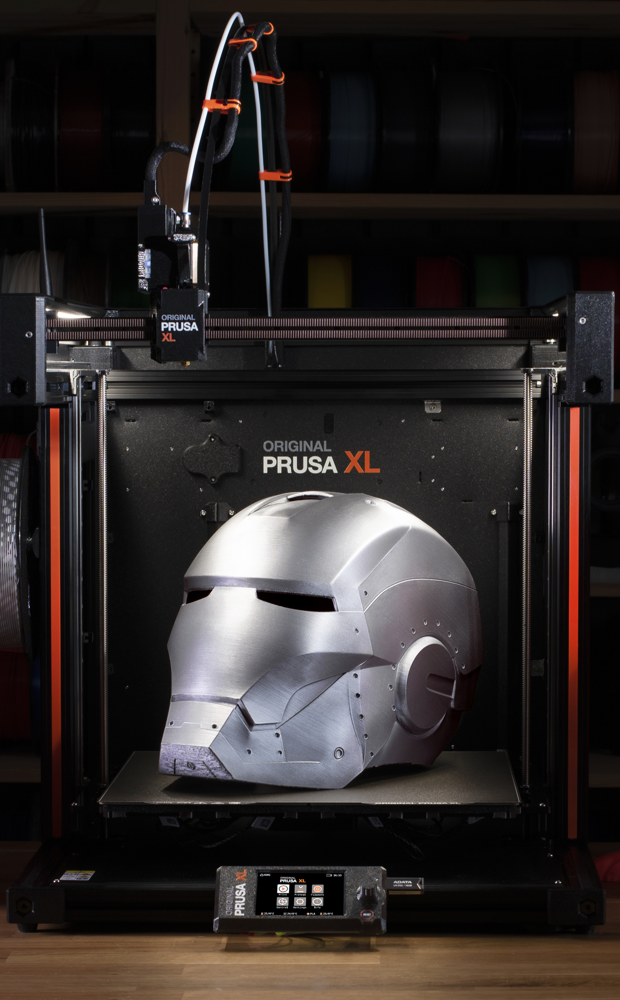
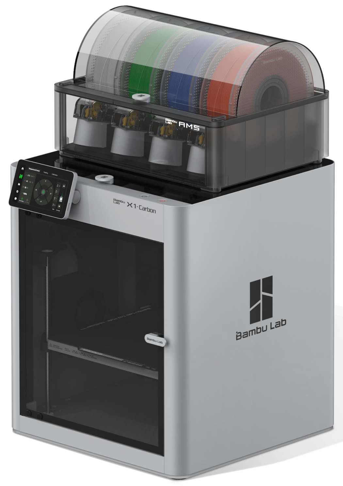
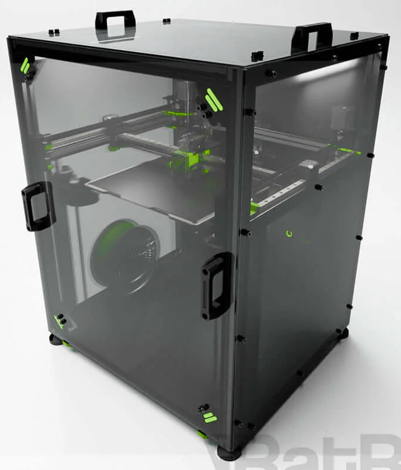

<grid drag="100 20" drop="top">
## 3D Printing for crafting
</grid>
<grid drag="50 70" drop="right">

</grid>

<grid drop="left">
Check out the presentation on Github!

You can scan the qr code here or at the end of the presentation

Q&A will be at the end of the presentation
</grid>
---
<grid drag="100 10" drop="top">
## Special thanks
</grid>
<grid drag="57 70" drop="left">
- Fursonalities
  + Made nearly all models I brought here today
  + Assisting and letting me try out new techniques
+ My family
  + Giving me time and having patience for my passion and hobby
+ Anybody here at the panel or viewing online for showing interest
</grid>
<grid drop="right">

Art by Fursonalities
</grid>

---
<grid drag="100 20" drop="top">
## Who is Dattas?
</grid>
<grid drag="40 70" drop="right">

Art by Fizero
</grid>
<grid drag="60 70" drop="left">
- Primarily a gray wolf
- Tech nerd, love playing with hardware and software
- Enjoys solving problems and helping
- Neurodivergent
</grid>

---
<grid drag="100 20" drop="top">
## Why should you trust me?
</grid>
<grid drag="100 80" drop="center">
1) You shouldn't trust me
2) Bought my first printer, a Printrbot simple metal, in June 2014. Have been printing since then.
3) Run a print farm of 13 printers
4) Have helped many creators across the world with making 3d printing more accessible to them
5) No seriously, don't trust me. Research what is best for you and your needs
</grid>

---
<grid drag="60 10" drop="topright">
## Why 3D print?
</grid>
<grid drag="40 100" drop="topleft" align="left">

- Model by Fursonalities
- Software: Nomad Sculpt

</grid>
<grid drag="62 70" drop="right" align="left">
+ Sculpt on your device, make changes, or revert with ease even years later
+ You can make rapid iterations on an idea you have
+ You can print out many of the same thing or with slight variations
+ Variety of materials with different properties you can utilize
</grid>
---
<grid drag="100 20" drop="top">
## What's not good about 3D printing?
</grid>
<grid drag="50 40" drop="bottomright">

</grid>
<grid drag="100 50" drop="left">
+ The process is not food safe
+ The process can produce waste that can't be recycled normally
+ Difficult to speed up, requires more machines to get more throughput
+ Layer and extrusion lines may be undesired and post processing may be needed
+ Print Failures 🍝
</grid>
---
<grid drag="100 20" drop="top">
## Software
</grid>
<grid drag="100 70" drop="center" align="left">
### Organic Modeling software:
+ Nomad sculpt - $20 one time. Android & iOS: [nomadsculpt.com]()
+ Blender - Free - PC only (mobile being worked on): [blender.org]()
+ Zbrush - $400/year - PC and iPad: [maxon.net]()

### CAD software:
+ OpenSCAD - Free, Open Source: [openscad.org]()
+ FreeCAD - Free, Open Source: [freecad.org]()
+ Autodesk Fusion - Free for personal/hobby use. Starts at $700/year otherwise. [https://www.autodesk.com/products/fusion-360/overview]()
</grid>
---
<grid drag="100 20" drop="top">
## Types of printers in this talk
</grid>
<grid drag="100 70" drop="center">
### SLA
Uses liquid resin and a UV laser or light to cure the resin. It peels the resin off of a film, lifts the bed away form the film and repeats.
### FDM
Uses filament, gears feed the filament into a hot end which melts it. It lays down layers one after another to build up the structure.
</grid>

---
<grid drag="100 20" drop="top">
## SLA - Good things
</grid>
<grid drag="20 100" drop="left">

</grid>
<grid drag="75 100" drop="-1 5">
- Great detail and you can print very small objects
- Number of objects don't matter, print time is determined by height of the tallest object and chosen layer height 
	- 1 copy of an object or 30 copies of the object, the time is the same!
- You can use a clear base resin and color the resin while in your tank, easily creating your own colors!
- You can add glitter or other materials to your resin to add additional properties, textures, or colors.
</grid>
---
## SLA Downsides
+ Printers can usually only print smaller objects
+ Resin has a relatively short shelf life of a few months to a year or so. If you don't use it before it expires, it won't print well and you can't regenerate it
+ Yellows quite quickly (sometimes while curing!) unless painted and protected from additional UV
+ A lot of reins warp easily and tends not to be accurate enough if you're looking for tight fits
---
## SLA Downsides
+ Messy and wasteful
	- You will need extra chemicals
	- You are dealing with liquids, spills will happen
	- You will need disposable gloves, respirators, and more as Personal Protective Equipment (PPE)
+ You must post process the parts you print after the printer is done.
	- Washing in IPA or another chemical that will help clean extra resin off of the part
	- Curing to full hardness by shining a lot more UV light onto the part
---
## SLA Toxicity
- Uncured resin is ***==toxic==*** . Read the MSDS!
	- Wear PPE if you are going to be in the same room as it when uncured for example while printing. Ideally you want to vent the printer outside to avoid the toxic fumes
	- Wear PPE when handling parts that have not been fully cured
	- Do not throw away any contaminated gloves, paper towels, IPA, or anything that has come in contact with the uncured resin until you've used UV light or sunlight to fully cure it
	- **==Do not wash or allow any uncured resin down your sink, into any waterways, or into your local environment!==**

---
## Dattas' SLA Recommendations
- Great for miniatures, if you're into Warhammer, D&D or other games where miniatures are used, this could be what you're looking for
- Great detail especially for smaller objects
- Very wasteful and messy
- Not fun to post process and you must post process
- Not fun to properly dispose or care of the toxic waste
- Due to possibly not being able to fully cure the middle of parts, resin printed parts are risky to use on anything that will be worn. Because of this it is not recommend for fursuit parts!

---
<grid drag="100 20" drop="top">
## FDM
</grid>
<grid drag="20 100" drop="left">

</grid>
<grid drag="75 100" drop="-1 5">
Pros:
- Tons of different materials with tons of different properties
- You can get very accurate parts
- More common than SLA

Cons:
- If you have more parts, it will take more time to print
- Slower and less detailed than Resin printing
- Layer lines and extrusions more noticeable 
</grid>

---
## Types of Filament
- PLA & PLA+
- PETG
- ABS
- PVB
- TPU/TPE
- More!
---
<grid drag="100 10" drop="top">
## PLA & PLA+
</grid>
<grid drag="100 85" drop="center" align="left">
- PLA is made from corn!
- Recommended uses: 
  - Figurines, prototypes, quick tests
- Upsides:
  - Cheap
  - Easiest thermoplastic to print
  - Comes in the most colors of any filament 
- Downsides:
  + Brittle
  + Deforms under mild heat or pressure
  + Creeps over time
  + PLA+ is not an established formula and will vary wildly
</grid>
---
<grid drag="100 10" drop="top">
## PETG
</grid>
<grid drag="100 80" drop="center" align="left">
- The material single use water and soda bottles are made from, with a slight modifier to make it easier to print
- Recommended uses: 
  - Functional parts, prototypes, quick tests
- Upsides:
  - Cheap
  - Relatively easy to print
  - Comes in quite a few colors
- Downsides:
  + More stringy than some others if not fully dry
</grid>
---
<grid drag="100 10" drop="top">
## ABS & ASA
</grid>
<grid drag="100 85" drop="center" align="left">
- The most popular engineering grade thermoplastic in the world
- Recommended uses:
  - Functional parts, long lasting parts, prototypes
- Upsides:
  - Cheap & Very heat resistant
  - You can smooth layer lines with Acetone vapors
  - ASA is also UV resistant
- Downsides:
  + Releases VOCs while printing and smells bad while printing
  + Needs a heated chamber
  + Warps easily
  + Shrinks more than other thermoplastics!
</grid>
---
<grid drag="100 10" drop="top">
## PVB
</grid>
<grid drag="80 70" drop="right" align="right">

</grid>
<grid drag="70 80" drop="left" align="left">
- Smooths layer lines when introduced to IPA
- Recommended uses:
  - Mold making or if you want to hide layer lines
- Upsides:
  - Easy to print
  - Removing layer lines and extrusion lines becomes much easier
- Downsides:
  + Expensive
  + Can't clean with IPA without it getting soft
</grid>
---
<grid drag="100 10" drop="top">
## TPU/TPE
</grid>
<grid drag="100 85" drop="0 5" align="left">
- Flexible plastic! 
- Upsides:
  - Very strong and durable
  - Can be cut with sharp scissors or utility knives after printing
  - Returns to shape after deformed
- Downsides:
  + Expensive
  + Difficult to print, basically impossible if you have a bowden printer.
  + Very stringy, even if tuned properly and dry
  + Might not be able to support it's own weight if it doesn't have enough infill or walls
</grid>
---
<grid drag="100 20" drop="top">
## 3D Printer brands
</grid>
<grid drag="80 100" drop="center">
These are *some* of the main players in 2025
- Prusa
- Bambu
- Voron
- Ratrig
- Others
## Which are tools and which are projects themselves?
</grid>
---
<grid drag="20 20" drop="topleft">
## Prusa
</grid>
<grid drag="20 100" drop="left">

</grid>
<grid drag="80 100" drop="right">
- ==Tool==
+ Moderate cost to high cost
+ Built to be repaired, and upgraded. 
+ You can build most of their models yourself and save some money!
+ Great upgrade paths, hardware and firmware
+ Warranty included, spare parts available
+ Decent support, 24/7 live chat
+ Develops with and gives back to open source (Prusa Slicer, firmware, hardware)
+ Great community
</grid>
<grid drag="20 20" drop="bottomleft" align="left">
[prusa3d.com]()
</grid>
---
<grid drag="30 10" drop="top">
## Bambu lab
</grid>
<grid drag="20 100" drop="right">

</grid>
<grid drag="80 100" drop="left" align="left">
- Tool
+ Low to moderate cost
+ Hardware not designed to be repaired or upgraded
+ Critical pieces glued together
+ Simple repairs take many times what other brands do
+ Software upgrades are released
+ Warranty included, Spare parts available
+ Slow and Low quality support
+ Community pressure to make them do what's right
+ Brand gaslights customers, has lied about what information their software collects
+ Brand takes away previously advertised features
</grid>
<grid drag="20 20" drop="bottomright" align="right">
[bambulab.com]()
</grid>
---
<grid drag="30 10" drop="topleft">
## Voron
</grid>
<grid drag="30 100" drop="left">

</grid>
<grid drag="70 100" drop="right">
- Project that becomes a tool
- Moderate to high cost
- Great design, build to be modified if desired but run great otherwise!
- Upgrade paths and upgrade kits!
- Built to be off the shelf parts plus mostly 3d printed parts
- Built for engineering filaments
- Good community
- Community and supplier only support and warranty
- Kits only from 3rd parties
</grid>
<grid drag="20 20" drop="bottomleft" align="left">
[vorondesign.com]()
</grid>
---
<grid drag="30 10" drop="topright">
## Ratrig
</grid>
<grid drag="30 100" drop="right">

</grid>
<grid drag="70 100" drop="left">
- Project that becomes a tool
- Moderate to high cost
- Good design
- Sometimes has upgrade paths and kits
- Built to be sturdy, some off the shelf parts, some custom. Few 3d printed parts
- Built for non engineering for most kits. Need 3rd party parts to handle engineering grade filament
- Smaller community
- Mostly community support
- Kits purchasable from Ratrig themselves
</grid>
<grid drag="20 20" drop="bottomright" align="right">
[ratrig.com]()
</grid>
---
<grid drag="100 10" drop="top">
## Others
</grid>
<grid drag="100 80" drop="center">
- Project to disposable project, rarely are these tools
- Creality, Elegoo, Anycubic, Quidi Tech, Ankr, Flashforge, etc
- Low Cost
+ No support/warranties to poor support/warranties
+ Rarely if ever gets software updates or hardware upgrades
+ Random and unlabeled hardware and software revisions. Which will you get when you purchase?
+ Some of these brands have been known to start fires due to providing too cheap critical components 
+ Communities vary
</grid>
---
# What furry things can you craft with a 3d printer?
---
<grid drag="100 10" drop="top">
## Head or other mold bucks
</grid>
<grid drag="40 100" drop="left">

Model by Pawstabilities
</grid>
<grid drag="60 100" drop="right">
- A positive piece to make a mold of
- Typically used to cast in another material
- Mold can be post processed and then many copies can be cast
- Buck can be used to make many molds to increase parallel castings
</grid>
---
<grid drag="100 20" drop="top">
## Accessories
</grid>
<grid drag="100 80" drop="center">
- Antlers and horns
- Buckles
- Claws
- Eye blanks
- Feathers
- Goggles
- Props
</grid>
---
<grid drag="100 10" drop="top">
## 3D Printed Foam
</grid>
<grid drag="40 80" drop="right">

Art from Revit's public profile
</grid>
<grid drag="60 80" drop="left">
- Technique I first saw by Revit
- Uses standard flexible 3d printer filament
- You can use modifier meshes to:
  - Alter density
  - Make holes for cables or air channeling
  - Make some parts solid
- Revit made the technique open source
- [https://linktr.ee/revitfur]()
- [https://github.com/RevFur/printable-foam-resources]()
</grid>
---
<grid drag="100 10" drop="top">
## 3D Printed Foam Head bases
</grid>
<grid drag="40 70" drop="left">

Gif from Fursonalities
</grid>
<grid drag="60 50" drop="right">
- Dattas' favorite headbase style
- Breathable
- Extremely strong
- Can cut with sharp scissors
- Can glue with hot glue
- Downsides
  - Must be lined as the plastic can irritate skin
  - Can deform if heated at high heat
</grid>
---
<grid drag="100 20" drop="top">
## 3D Printed Foam Paws and Hooves
</grid>
<grid drag="40 80" drop="bottomright">

Model by Fursonalities
</grid>
<grid drag="60 50" drop="left">
- Flexible so hooves or claws won't chip or crack if bumped into things
- Can be textured in the model
- Light weight compared to resin
- More breathable than foam or resin so you don't get as much sweat build up
</grid>
---
<grid drag="100 20" drop="top">
## 3D Printed Foam Body Padding
</grid>
<grid drag="100 50" drop="center">
- More breathable than standard foam or polyfill
- Keeps its shape better than polyfill
- Can integrate other things into the structure like speakers, fans, pumps, cable routing, etc
- Can be put into padding pockets like polyfill
- A lot of time and work to create
- Expensive due to the amount of printing required
</grid>
---
# What does Dattas primarily use his own printers for?
---
<grid drag="100 10" drop="top">
## Solving problems
</grid>
<grid drag="100 90" drop="center">
- Home organization: pegboard, shelve, and drawer organizers
- Furniture modifications
- Electronics Cases, Hard drive/SSD sleds, conduit bushing
- Tools: Heat insert press, CNC Mill, Filament winders
- Squeegee hook for my shower
- Phone mount for controllers and desks
- Safe bird landing deterrent
- Cases for games and cards
- Custom Stamps and customized gifts
- Wanting more 3D printers
</grid>
---
<grid drag="100 20" drop="top">
## Q&A
</grid>
<grid drag="40 100" drop="left">

</grid>
<grid drag="50 100" drop="-1 5" align="left">
Thanks for listening to me ramble! Now I want to hear your questions!

If you want to view or download a copy of this presentation online, scan the QR code!
</grid>
